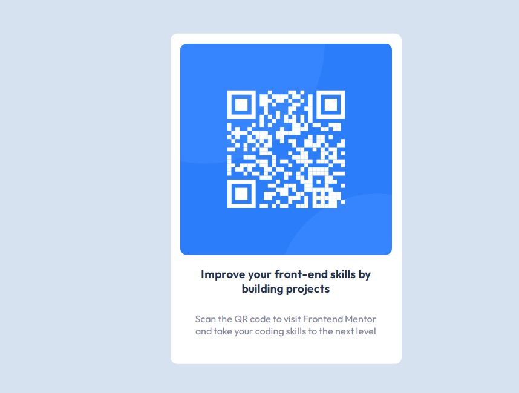

# Frontend Mentor - QR code component solution

This is a solution to the [QR code component challenge on Frontend Mentor](https://www.frontendmentor.io/challenges/qr-code-component-iux_sIO_H). Frontend Mentor challenges help you improve your coding skills by building realistic projects. 

## Table of contents

- [Overview](#overview)
  - [Screenshot](#screenshot)
  - [Links](#links)
- [My process](#my-process)
  - [Built with](#built-with)
- [Author](#author)
- [Acknowledgments](#acknowledgments)

## Overview
This is a solution to a front end development challenge on frontendmentor.io which I solve with mobile first design and use clamp() property to add some responsiveness to parts of the site to scale to desktop

### Screenshot

### Links

- Solution URL: https://isaacharrison28.github.io/QR-code-for-frontendmentor
- Live Site URL: https://isaacharrison28.github.io/QR-code-for-frontendmentor/

## My process
Tackled the design with the mobile first approach to ensure that the site is readily available for mobile users ( which are the most commom users of the web )

### Built with

- Semantic HTML5 markup
- CSS custom properties
- Flexbox
- Mobile-first workflow

## Author

- Website - https://isaacharrison28.netlify.app
- Frontend Mentor - https://www.frontendmentor.io/profile/isaacharrison28
- Twitter - https://www.twitter.com/IsaacHarrisonT

## Acknowledgments

A big appreciation to frontendmentor.io for providing a detailed description of the challenge

